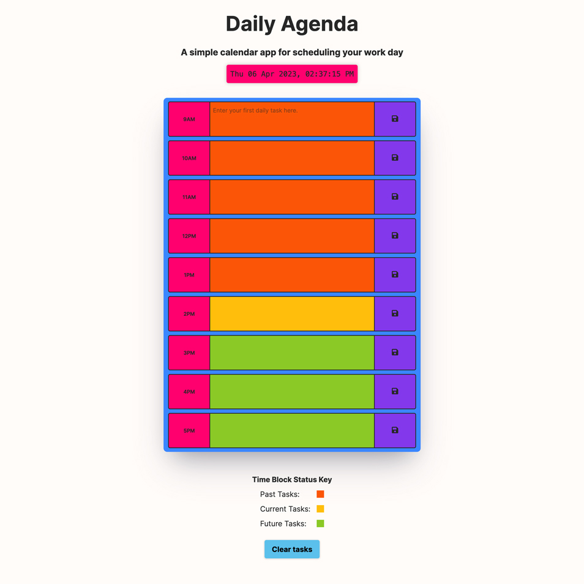
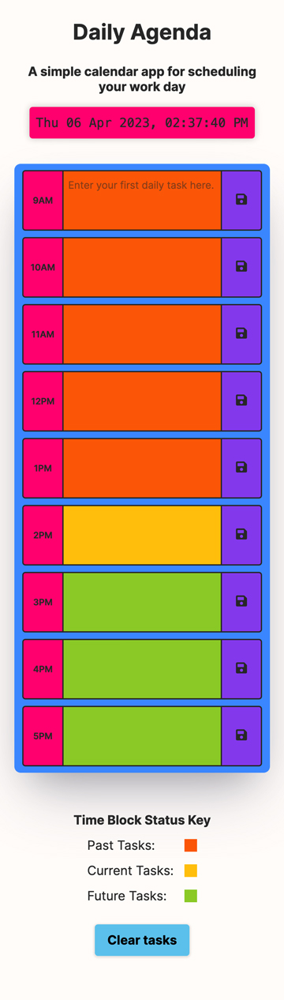

# Daily Agenda App

A daily work schedular app powered by jQuery

## Table of Contents

[The Assignment Brief](#the-assignment-brief)

- [User Story](#user-story)

- [Acceptance Criteria](#acceptance-criteria)

[Github Pages & Repository Links](#github-pages-&-repository-links)

[Daily Agenda Screenshots](#daily-agenda-screenshots)

[Acknowledgements](#acknowledgements)

## The Assignment Brief

Create a simple calendar application that allows a user to save tasks for each hour of the work day. The app will run in the browser and feature dynamically updated HTML and CSS powered by jQuery.

Use the day.js api library to work with date and time.

### User Story

As an employee with a busy schedule, I want to add important tasks to a daily planner.

### Acceptance Criteria

Given I am using a daily planner to create a schedule:

- When I open the planner, then the current date and time is displayed at the top of the calendar.

- When I scroll down, then I am preseneted with time blocks for standard business hours 9 - 5.

- When I view the time blocks for that day, then each time block is color-coded to indicate whether it is in the past, present, or future.

- When I click into a time block, then I can enter a task.

- When I click the save button for that time block, then the text for that event is saved in local storage.

- When I refresh the page, then the saved events persist.

## Github Pages & Repository Links

[Github Pages](https://matthew-millard.github.io/daily-agenda-app/)

[Github Repository](https://github.com/matthew-millard/daily-agenda-app)

## Daily Agenda Screenshots

## Acknowledgements

Initial starter code provided by:

[George Yoo](https://github.com/Georgeyoo)

[Matt Fyke](https://github.com/mfyke)

[Courtney Mathena](https://github.com/courtthecoop)